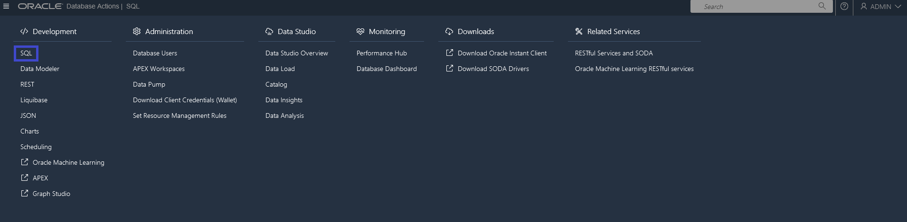
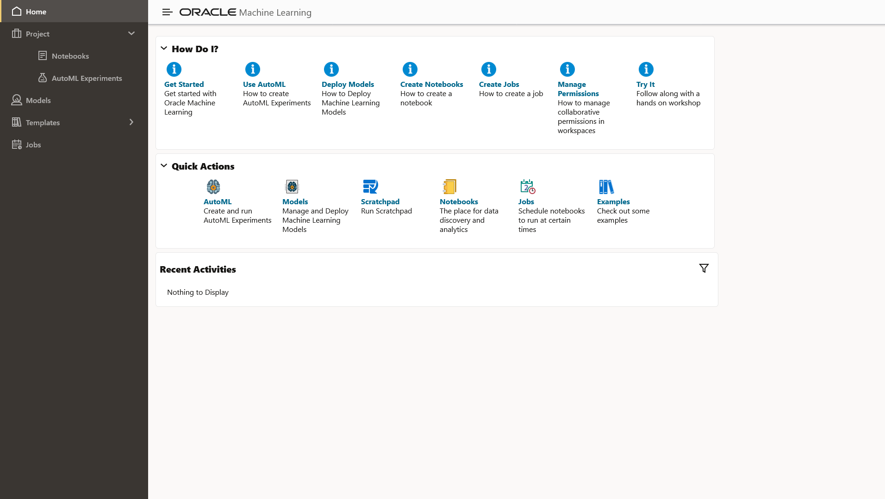
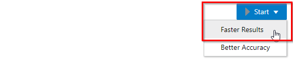
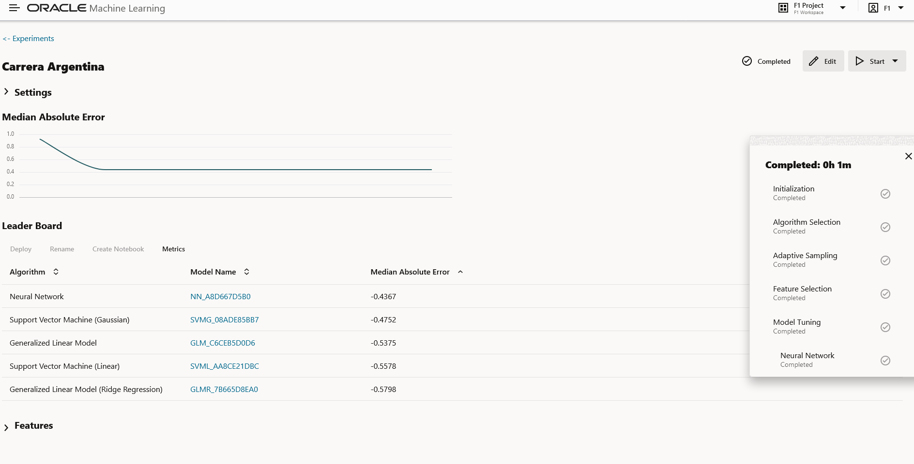

# Grand Prix Argentina - Race 1

**¿Porqué una carrera de F1 es emocionante?**

Es una pregunta que tiene una respuesta distinta según a que persona le preguntemos y nos ta también un contexto ideal para hacer Data Science.

En este sentido, en esta carrera usaremos datos de la Evaluación de Experiencia de los Fanáticos de la Fórmula 1 (F1) y crearemos un experimento para entrenar 5 algoritmos de Machine Learning usando Auto Machine Learning (Auto ML) en Autonomous Data Warehouse (ADW) y con el Feature Importance analizaremos lo que la Inteligencia Artificial "piensa".

`Pre-requisito: para comenzar, se asume que ya el participante tiene aceso a Oracle Cloud Infrastructure (OCI) y un ADW disponible.`

Las (5) vueltas para llegar a la meta son:

## 1. Buscar nuestra consola de ADW  [INICIO]

Desde el inicio en consola **Oracle Cloud Infrastructure (OCI)**, presionando el `Menú de Hamburgesa` ubicado arriba a la izquierda de la pantalla podemos ubicar todas las opciones de la nube:


Luego, en el menu que se despliega seleccionamos primero `Oracle Data Bases` y después `Autonomous Data Warehouse`.

Y allí veremos todas las instancias que tenemos creadas.


Actualmente mi instancia se llama `ADWF1` y está Available, en este sentido, debes observar un escenario similar con el nombre de base de datos que hayas escogido.

Luego, en caso de que no veas tu actual innstancia puedes verificar y ajustar:

- Tenancy. Ejemplo: US East (Ashburn).
- Compartment. Ejemplo: Public Sector.
- Worload Type. Ejemplo: Data Warehouse.

Luego dando click en la instancia `ADWF1` llegamos a los detalles:


2. Crear un usuario de base de datos llamado F1 uando Databse Actions.


En el siguiente paso nos concentraremos en las Data Base Actions, en el que haciendo click nos abrirá una nueva pestaña en el navegador y nos preguntara por nuestro usuario (ADMIN) y contraseña.


Luego, veremos la interfaz principal y seleccionaremos la opción **DATABASE USERS**.


En este apaartado daremos click en el botón `+ Create New User`.

Y finalmente crearemos nuestro usuario `F1` con las opciones que vemos en pantalla:


`Nota: en caso de que no veas estas pantallas, verifica que las pantallas emergentes PopUps de tu navegador este habilitadas, usualmente aparecen con un mensaje visible a la izquierda de la barra de navegación.`

## 2. Cargar un set de datos

Existen varias formas de hacer este paso, y el camino seleccionado apunta a que un usuario gestor de la base de datos (ADMIN) en su labor de data managment carge los datos y otorge un acceso al científico de datos (F1). 

Entonces, aun con el usuario ADMIN abrimos el menu de la hamburgesa que está arriba a la izquierda y de la solapa `Data Studio` seleccionamos `Data Load.`


Y luego seleccionamos las opciones `LOAD DATA`, `CLOUD STORE` y damos click en `Next`.


Aquí usaremos el siguiente:

- **ENLACE_PUBLICO:** https://objectstorage.us-ashburn-1.oraclecloud.com/n/idi1o0a010nx/b/oci-public-bucket/o/F1_RACES_TRAIN.json

Y lo copiaremos en lo copiaremos en la barra:


Y con el click izquierdo del maouse, arrastraremos el set de datos `F1_RACES_TRAIN` del panel izquierdo al panel derecho.


Luego daremos play al **botón verde** para ejecutar nuestro job, que consiste en, tomar los datos `F1_RACES_TRAIN` en formato `json` alojados en un **Object Storage Público** e insertarlos en una nueva Tabla `F1_RACES_TRAIN` en el esquema ADMIN.


Y una vez que termine el job, veremos un cuadro de confirmación:


Finalmente con el mismo usuario ADMIN, vamos a verificar la tabla que se creó en el ADW. Para ello desde el `<Development>` seleccionamos `SQL`.



Y allí vemos a la izquierda la tabla `F1_RACES_TRAIN`.


Podemos hacer un preview de la tabla con:

```sql
SELECT
    *
FROM
    F1_RACES_TRAIN
```


Esta tabla `F1_RACES_TRAIN` fué el producto de funcionar otros sets de datos de Fórmula 1 y hacer Ingeniería de Atributos, y ese contexto es suficienta para nuestro objetivo, en este sentido si quieres todos los detalles como un opcional después de terminar la carrera, el link se encuentra al final de este documento.

Debes saber, que:

- Cada `fila` respresenta una carrera.
- Nuestro **TARGET** será el `SCORE`, que representa que tan "buena" fué la experiencia según una encuesta a los aficionados y será lo que queremos predecir.


En la siguiente vuelta necesitaremos usar al usuario `F1`, como la tabla `F1_RACES_TRAIN` la creamos desde el usuario **ADMIN**, debemos otogar permisos de lectura al usuario **F1**, por lo tanto, ubicados en la misma pantalla borramos el Query anterior y ejecutamos el siguiente comando:

```sql
GRANT ALL ON F1_RACES_TRAIN TO F1
```


Finalmente, buscaremos el link que le compartiremos al usuario**F1** seleccionado `Oracle Machine Learning`.


Y en la siguiente pantalla debemos logear como usuario **F1**.


## 3. Crear un Experimento de Auto Machine Learning (Auto-ML)

Ahora, llegó el momento de hacer Auto ML!

Recordando que ahora estamos con el usuario **F1** Iniciaremos creando un `AutoML Experiments`:



Damos click en el botón `+ Create`:


Seleccionamos:

- Name: Argentina Grand Prix
- Data Source: ADMIN.F1_RACES_TRAIN
- Predict: SCORE
- Prediction Type: Regression
- Case ID: RACEID


En Additional Settings seleccionaremos las siguientes opciones:


El más importante es la Métrica debemos seleccionar `Median Absolute Error (MAE)`, el cual es un indicador de la imprecisión que puede llegar a tener nuestros modelos.

"Por ejemplo, si el modelo predice 100 y tenemos un MAE de 2, significa que el modelo el valor "real" podría ser 102 o 98."

En cuanto a las Features, debes selccionar solo las que están marcadas:


Regresamos al inicio de la página y guardamos nuestro expermiento:


## 4. Iniciar Entrenamiento

El siguiente paso es iniciar el experimento con los resultados más rápidos.



Y estár atentos a que el entrenamiento termine:



## 5. Encontrar el top 3 de atributos más importantes [FINAL]

Desplegamos la pestaña de Features:


Vemos que le más importante fue:

1. F1DATE
2. CIRCUITOREF
3. DNF_DUE_TO_ACCIDENT_COUNT


## Nota Final

Este laboratorio fue diseñado a partir los [LiveLabs](https://apexapps.oracle.com/pls/apex/r/dbpm/livelabs/home?session=111942316258990) en [Title Learn Analytics and Machine Learning with Red Bull Racing](https://apexapps.oracle.com/pls/apex/r/dbpm/livelabs/view-workshop?wid=909&clear=RR,180&session=111942316258990)
